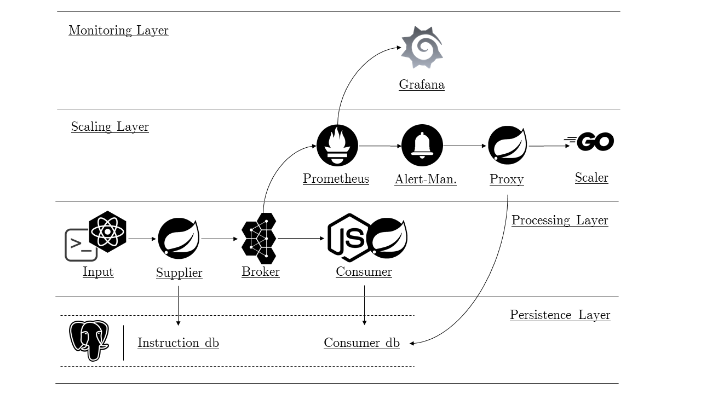
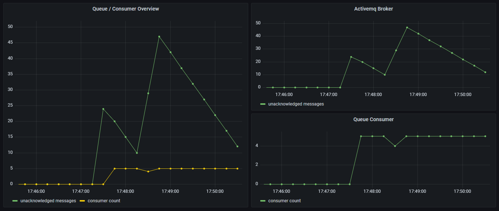
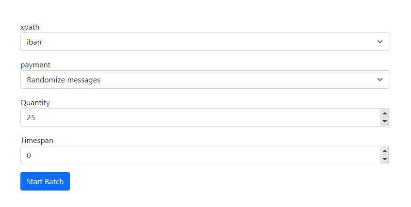

# Instant Payment Demo

Project to showcase the general approach of processing an instant payment provided by the DPS Gmbh. The focus of the project is to monitor the duration it takes for a swarm of containers to start completely. When confronted with multiple unacknowledged messages the project will scale the consumer components appropriate to the number of messages.

## Run Application
When the benchmark tests starts up the following stages have to be executed

1. Create the images 
2. Start stack
3. Create traffic

The first two steps can be automatically started by calling the [./clean-build-run.sh](./clean-build-run.sh) script. To generate traffic execute the [./generate-traffic.sh](./generate-traffic.sh) script. If you want to create custom requests, take a look at the [request-scripts](./request-scripts) directory where multiple examples are mentioned and another script [curl-benchmark.sh](./request-scripts/curl-benchmark.sh) can be used for specific requests.

## Components
### Stack 

| Name | Usage |
|------|-------|
| **supplier-frontend**| React frontend displaying a form where the user can input the benchmark request details|
| **supplier-backend**| Spring project that interpretes the user input and generates appropriate benchmark request|
| **amq broker**| message broker that takes in the messages generated by the supplier-backend component|
| **consumer**| consumes the messages from the broker by processing the attacked data|
| **prometheus**| scrapes metrics from enrolled services and sends alerts to alertmanager if certain rule conditions cannot be met|
| **alertmanager**| service that reacts on the alerts generated by the prometheus component and sends an api call to the proxy service|
| **proxy-scaler**| middle man that translates a given scaling instruction to the docker scaler component api, also generates a timestamp that is used when determining the starting time of the consumer service|
| **docker-scaler**| service that has access on the docker socket and provides an api that is used to scale the consumer service depending on the unacknowledged message count in the message broker|
| **grafana**| displays the metrics scraped by the prometheus component|
| **history-db**| database persisting the requests triggered in the supplier-backend|
| **script-db**| database persisting content generated by the node consumer|
| **spring-db**| database persisting content generated by the spring consumer|
| **pgadmin**| database client to view content|
| **mock-api**| mock scaler api, used for local development|

### Scripts
- **requests-scripts**: scripts to generate traffic by sending requests in custom grammer to the supplier-backend api
- **stack scripts**: various scripts used in the development as well as exorting functionality in production

### Dashboard

### Benchmark Request Form

### Useful cli commands
- `docker stack rm vossibility && docker stack deploy --compose-file docker-compose.yml vossibility`
- `docker stack services vossibility`
- `docker service rm <SERVICE-NAME>`
- `docker service update --force vossibility_prometheus`
- `docker service logs vossibility_prometheus`

### Todos
- take keyword 'microprofile' out of table of contents or say something about it in the text
- create processing time benchmark
- test individual on server 
- test benchmark on server 
- rename projects
- write intro to thesis
- find resources to container startup times
- make spring / node consumer implement two face commit (is glaub ich egal)
- timestamps in wrong timezone (proxy service)
- javadoc proxy service
- lint code checks on all project
- rename entry point in proxy (still says testapp in title)
- set all ports in docker-compose to read from .env
