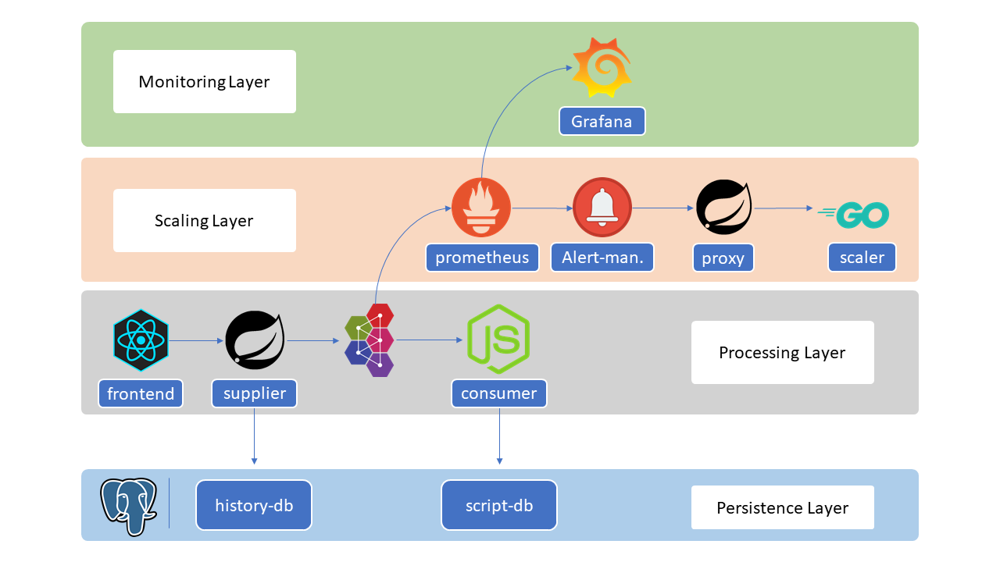

# Instant Payment Demo

Project to showcase the general approach of processing an instant payment provided by the DPS Gmbh. The focus of the project is to monitor the duration it takes for a swarm of containers to start completely. When confronted with multiple unacknowledged messages the project will scale the consumer components appropriate to the number of messages.

### Components
- **supplier-frontend**: React frontend displaying a form where the user can input the benchmark request details
- **supplier-backend**: Spring project that interpretes the user input and generates appropriate benchmark request
- **amq broker**: message broker that takes in the messages generated by the supplier-backend component
- **consumer**: consumes the messages from the broker by processing the attacked data
- **prometheus**: scrapes metrics from enrolled services and sends alerts to alertmanager if certain rule conditions cannot be met
- **alertmanager**: service that reacts on the alerts generated by the prometheus component and sends an api call to the proxy service
- **proxy-scaler**: middle man that translates a given scaling instruction to the docker scaler component api, also generates a timestamp that is used when determining the starting time of the consumer service
- **docker-scaler**: service that has access on the docker socket and provides an api that is used to scale the consumer service depending on the unacknowledged message count in the message broker
- **grafana**: displays the metrics scraped by the prometheus component

### Dashboard

### Benchmark Request Form

### Useful cli commands
- `docker stack rm vossibility && docker stack deploy --compose-file docker-compose.yml vossibility`
- `docker stack services vossibility`
- `docker service rm <SERVICE-NAME>`
- `docker service update --force vossibility_prometheus`
- `docker service logs vossibility_prometheus`

### Todos
- average start time seems kind of off
- timestamps in wrong timezone (proxy service)
- javadoc proxy service
- fix indent in node project
- lint code checks on all project
- spring backend add randome field requests
- spring api add option to create waves of requests
